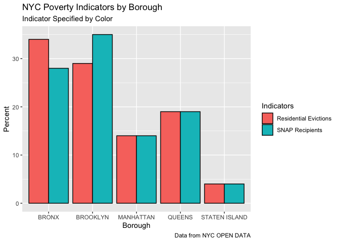

NYC Social Services Project
================
Rakel Faaland

# Analysis of Resources by Borough

## **INTRODUCTION**

### Research Question:

I am interested in exploring the following research question: **What
resources are available to New Yorkers living in poverty or at risk of
homelessness?**

In New York City, there are a lot of people experiencing homelessness,
and the problem has only increased since the COVID-19 pandemic.
According to predictions by the United States Census Bureau, 17% of New
York City live in poverty. Solving the issue of poverty and homelessness
is complex, and every individual has a unique set of needs that requires
different services. In my analysis, I want to investigate what resources
are available to serve those living in poverty and those at risk of, or
experiencing, homelessness.

### Data Sources:

For this project, I use NYC Open Data as the source of all my data. NYC
Open Data provides free data to the public from various New York City
government agencies. The NYC Office of Technology and Innovation manages
NYC Open Data. The datasets I will be using are detailed below.

-   [“Directory Of Homebase
    Locations”](https://data.cityofnewyork.us/Social-Services/Directory-Of-Homebase-Locations/ntcm-2w4k)

    -   The “Directory Of Homebase Locations” dataset is provided by the
        Department of Homeless Services (DHS). The DHS is a government
        organization that provides services to New Yorkers who are
        experiencing homelessness.

    -   This dataset has 26 rows and 14 columns. Each observation is a
        homebase office. The variables in this dataset are the
        following: Provider, Service Area Zipcode, Address, Phone
        Number, Postcode, Borough, Latitude, Longitude, Community Board,
        Council District, Census Tract, BIN, BBL, NTA.

-   [“Evictions”](https://data.cityofnewyork.us/City-Government/Evictions/6z8x-wfk4)

    -   The “Evictions” dataset is provided by the Department of
        Investigation (DOI). The DOI is a government law enforcement
        agency that conducts covert investigations within the government
        and in organizations receiving benefits from the New York City
        government programs.

    -   This dataset has 71.2K rows and 20 columns. Each observation is
        an eviction. The variables in this dataset are the following:
        Court Index Number, Docket Number, Eviction Address, Evictions
        Apartment Number, Executed Date, Marshal First Name, Marshal
        Last Name, Residential/Commercial, Borough, Eviction Postcode,
        Ejectment, Eviction/Legal Possession, Latitude, Longitude,
        Community Board, Council District, Census Tract, BIN, BBL, NTA.

-   [“Buildings by Borough and Community
    District”](https://data.cityofnewyork.us/Social-Services/Buildings-by-Borough-and-Community-District/3qem-6v3v)

    -   The “Buildings by Borough and Community District” dataset is
        provided by the Directory of Homeless Services (DHS). The DHS is
        a government organization that provides services to New Yorkers
        who are experiencing homelessness.

    -   This dataset has 2,578 rows and 10 columns. Each observation is
        a shelter. The variables in this dataset are the following:
        Report Date, Borough, Community District, Adult Family Community
        Hotel, Adult Family Shelter, Adult Shelter, Adult Shelter
        Community Hotel, Families With Children Cluster, Families With
        Children Community Hotel, Families With Children Shelter.

-   [“Borough/Community District Report - SNAP
    Population”](https://data.cityofnewyork.us/Social-Services/Borough-Community-District-Report-SNAP-Population/jye8-w4d7)

    -   The “Borough/Community District Report - SNAP Population”
        dataset is provided by the Human Resources Administration (HRA).
        The HRA is a government organization that helps low-income New
        Yorkers with food assistance and emergency rental assistance.

    -   This dataset has 1,003 rows and 5 columns. Each observation is a
        monthly report on a community district. The variables in this
        dataset are the following: Month, Borough, Community District
        Number, SNAP recipients, SNAP households.

-   [“DYCD after-school programs: Jobs and
    Internships”](https://data.cityofnewyork.us/Education/DYCD-after-school-programs-Jobs-and-Internships/99br-frp6)

    -   The “DYCD after-school programs: Jobs and Internships” dataset
        is provided by the Department of Youth and Community Development
        (DYCD). The DYCD is a government organization that supports
        youth and families in New York by funding community
        organizations.

    -   This dataset has 208 rows and 18 columns. Each observation is a
        program. The variables in this dataset are the following:
        Program Type, Program, Site Name, Address, Borough, Postcode,
        Agency, Contact Number, Grade Level / Age Group, Location 1,
        Latitude, Longitude, Community Board, Community Council, Census
        Tract, BIN, BBL, NTA.

-   [“Financial Empowerment
    Centers”](https://data.cityofnewyork.us/Business/Financial-Empowerment-Centers/dt2z-amuf)

    -   The “Financial Empowerment Centers” dataset is provided by the
        Department of Consumer and Worker Protection (DCWP). The DCWP is
        a government organization that supports businesses and
        individuals regarding finance. They license businesses, provide
        business resources, advocate for wages, and provide community
        outreach like their Financial Empowerment Centers.

    -   This dataset has 23 rows and 23 columns. Each observation is a
        center. The variables in this dataset are the following:
        Provider, Host Organization, Building, Street, City, Borough,
        Postcode, Site Location Address, Days Open, Hours, Language(s),
        Telephone, Council District, Community Board, BBL, NTA, X
        coordinates, Y coordinates, Latitude, Longitude, Census Tract,
        BIN, Location.

-   [“Directory of NYCHA Community
    Facilities”](https://data.cityofnewyork.us/Social-Services/Directory-of-NYCHA-Community-Facilities/crns-fw6u)

    -   The “Directory of NYCHA Community Facilities” dataset is
        provided by the New York City Housing Authority (NYCHA). NYCHA
        is a government organization that provides public housing to
        low-income New Yorkers. It also connects its recipients with
        opportunities related to career advancement, continuing
        education, and learning about financial health.

    -   This dataset has 430 rows and 16 columns. Each observation is a
        NYCHA community facility. The variables in this dataset are the
        following: Type, Funding Agency, Borough, Program Type, Status,
        Development, Address, Sponsor, Latitude, Longitude, Community
        Board, Council District, Census Tract, BIN, BBL, NTA.

-   [“Directory of SNAP
    Centers”](https://data.cityofnewyork.us/Social-Services/Directory-of-SNAP-Centers/tc6u-8rnp)

    -   The “Directory of SNAP Centers” dataset is provided by the Human
        Resources Administration (HRA). The HRA is a government
        organization that helps low-income New Yorkers with food
        assistance and emergency rental assistance.

    -   This dataset has 14 rows and 16 columns. Each observation is a
        SNAP center. The variables in this dataset are the following:
        Borough, Facility Name, Street Address, City, Postcode, State,
        Phone Number(s), Comments, Latitude, Longitude, Community Board,
        Council District, Census Tract, BIN, BBL, NTA.

-   [“New York City Population by Borough, 1950 -
    2040”](https://data.cityofnewyork.us/City-Government/New-York-City-Population-by-Borough-1950-2040/xywu-7bv9)

    -   The “New York City Population by Borough, 1950 - 2040” dataset
        is provided by the Department of City Planning (DCP). The DCP is
        a government organization that oversees city land use for
        housing, neighborhood development, sustainability, and economic
        development.

    -   This dataset has 6 rows and 22 columns. Each observation
        represents a total. The 6 rows contain the 5 boroughs and a row
        for New York City as a whole. The variables in this dataset are
        the following: Age Group, Borough, 1950, 1950 - Borough Share of
        NYC Total, 1960, 1960 - Borough Share of NYC Total, 1970, 1970 -
        Borough Share of NYC Total, 1980, 1980 - Borough Share of NYC
        Total, 1990, 1990 - Borough Share of NYC Total, 2000, 2000 -
        Borough Share of NYC Total, 2010, 2010 - Borough Share of NYC
        Total, 2020, 2020 - Borough Share of NYC Total, 2030, 2030 -
        Borough Share of NYC Total, 2040, 2040 - Borough Share of NYC
        Total.

### Method:

In order to investigate my research question, I will use the data sets I
have selected above to create three new data frames. These data frames
will contain counts and percentages by the borough of the New York City
population, New York City resources, and New York City poverty
indicators.

For the New York City population data frame, I will be using only the
data from 2020. This data will give context to my later analysis of the
distribution of resources and poverty indicators by depicting how New
York City’s population is spread throughout the five boroughs.

The New York City resources data frame will contain the following
variables: Homebase Offices, Shelters, Employment Programs, Financial
Empowerment Centers, Community Centers, and SNAP Centers. This will show
how these resources are distributed through the five boroughs of New
York City.

The poverty indicators data frame will contain the following variables:
Residential Evictions, and SNAP Recipients. These variables will be used
to identify cases of people experiencing economic hardship and at risk
of homelessness. It will help to identify where the greatest need for
resources is in New York City’s five boroughs.

In my analysis, I will compare the distribution of resources, poverty
indicators, and population within each borough to provide a picture of
the need and resource allocation in New York City by borough.

## **OVERVIEW**

### How should New York City’s resources be distributed?

New York City’s population is not distributed evenly throughout the five
boroughs. Figure 1 shows that Brooklyn and Queens have the highest
percentage of the population - at 31% and 27%. The Bronx and Manhattan
have roughly 10% less - at 17% and 19%. Staten Island has the least
amount of people - at about 6%.

New York City should distribute resources based on the need of each
borough. Therefore, the distribution of poverty indicators, rather than
the population, is more important. Figure 2 demonstrates the
distribution of evictions and SNAP recipients by borough. This graph
shows that the Bronx and Brooklyn have between 28% and 35% of
residential evictions and SNAP recipients in New York City. This is the
highest percentage in all boroughs, indicating that residents of these
two boroughs may have a higher need for resources. Manhattan and Queens
have between 14% and 19% of residential evictions and SNAP recipients.
Staten Island has the least of all with 4% of residential evictions and
SNAP recipients.

### How is New York City distributing resources to help alleviate poverty?

Figure 4 depicts the distribution of resources aimed to help people
experiencing poverty. These resources are defined in the legend as
homebase offices, shelters, employment programs, financial empowerment
centers, community centers, and SNAP centers.

-   The homebase offices are locations where people who are at risk of
    experiencing homelessness can get resources such as temporary
    housing.

-   Shelters are homeless shelters where people experiencing
    homelessness can live.

-   Employment programs are programs for youth and adults.

-   Financial empowerment centers are places where people can get
    training and advice to better manage their finances and get out of
    poverty.

-   Community centers are places that are open to the public for
    recreation. These include senior centers, family centers, and more.

-   SNAP centers are locations where people can receive benefits such as
    food assistance.

Figure 4 shows that Brooklyn, the Bronx, and Manhattan generally have a
higher percentage of resources than Queens and Staten Island. However,
this is not true for every benefit. (See Figure 5 for detailed plots on
each resource.) Nonetheless, it does demonstrate that New York City is
allocating resources well based on need because Figure 2 shows that
Brooklyn and the Bronx have the highest need.

Figure 1

<!-- -->

Figure 2

<!-- -->

Figure 3

<table class="table table-bordered table-condensed table-hover" style="margin-left: auto; margin-right: auto;">
<caption>
NYC Poverty Indicators
</caption>
<thead>
<tr>
<th style="text-align:left;">
Borough
</th>
<th style="text-align:right;">
Residential Evictions
</th>
<th style="text-align:right;">
SNAP Recipients
</th>
</tr>
</thead>
<tbody>
<tr>
<td style="text-align:left;">
BRONX
</td>
<td style="text-align:right;">
24359
</td>
<td style="text-align:right;">
9291609
</td>
</tr>
<tr>
<td style="text-align:left;">
BROOKLYN
</td>
<td style="text-align:right;">
21182
</td>
<td style="text-align:right;">
11583019
</td>
</tr>
<tr>
<td style="text-align:left;">
MANHATTAN
</td>
<td style="text-align:right;">
10233
</td>
<td style="text-align:right;">
4627977
</td>
</tr>
<tr>
<td style="text-align:left;">
QUEENS
</td>
<td style="text-align:right;">
13621
</td>
<td style="text-align:right;">
6151853
</td>
</tr>
<tr>
<td style="text-align:left;">
STATEN ISLAND
</td>
<td style="text-align:right;">
2678
</td>
<td style="text-align:right;">
1300694
</td>
</tr>
</tbody>
</table>

Figure 4

<!-- -->

***See below for detailed plots***

Figure 5

<!-- -->

Figure 6

<table class="table table-bordered table-condensed table-hover" style="margin-left: auto; margin-right: auto;">
<caption>
NYC Resources by Borough
</caption>
<thead>
<tr>
<th style="text-align:left;">
Borough
</th>
<th style="text-align:right;">
Hombases
</th>
<th style="text-align:right;">
Shelters
</th>
<th style="text-align:right;">
Employment Programs
</th>
<th style="text-align:right;">
Financial Empowerment Centers
</th>
<th style="text-align:right;">
Community Centers
</th>
<th style="text-align:right;">
SNAP Centers
</th>
</tr>
</thead>
<tbody>
<tr>
<td style="text-align:left;">
BRONX
</td>
<td style="text-align:right;">
10
</td>
<td style="text-align:right;">
696
</td>
<td style="text-align:right;">
45
</td>
<td style="text-align:right;">
4
</td>
<td style="text-align:right;">
89
</td>
<td style="text-align:right;">
3
</td>
</tr>
<tr>
<td style="text-align:left;">
BROOKLYN
</td>
<td style="text-align:right;">
10
</td>
<td style="text-align:right;">
929
</td>
<td style="text-align:right;">
75
</td>
<td style="text-align:right;">
6
</td>
<td style="text-align:right;">
125
</td>
<td style="text-align:right;">
3
</td>
</tr>
<tr>
<td style="text-align:left;">
MANHATTAN
</td>
<td style="text-align:right;">
2
</td>
<td style="text-align:right;">
676
</td>
<td style="text-align:right;">
41
</td>
<td style="text-align:right;">
8
</td>
<td style="text-align:right;">
153
</td>
<td style="text-align:right;">
4
</td>
</tr>
<tr>
<td style="text-align:left;">
QUEENS
</td>
<td style="text-align:right;">
2
</td>
<td style="text-align:right;">
697
</td>
<td style="text-align:right;">
41
</td>
<td style="text-align:right;">
4
</td>
<td style="text-align:right;">
42
</td>
<td style="text-align:right;">
3
</td>
</tr>
<tr>
<td style="text-align:left;">
STATEN ISLAND
</td>
<td style="text-align:right;">
2
</td>
<td style="text-align:right;">
69
</td>
<td style="text-align:right;">
5
</td>
<td style="text-align:right;">
1
</td>
<td style="text-align:right;">
21
</td>
<td style="text-align:right;">
1
</td>
</tr>
</tbody>
</table>

### Statistics on Resources in New York City

Figure 7

Standard Deviation has been rounded to whole numbers.

<table class="table table-bordered table-condensed table-hover" style="margin-left: auto; margin-right: auto;">
<caption>
Statistics on NYC Resources by Borough
</caption>
<thead>
<tr>
<th style="text-align:left;">
Resource
</th>
<th style="text-align:right;">
Minimum
</th>
<th style="text-align:right;">
Maximum
</th>
<th style="text-align:right;">
Mean
</th>
<th style="text-align:right;">
Standard Deviation
</th>
<th style="text-align:right;">
Median
</th>
<th style="text-align:right;">
IQR
</th>
</tr>
</thead>
<tbody>
<tr>
<td style="text-align:left;">
Homebase Offices
</td>
<td style="text-align:right;">
2
</td>
<td style="text-align:right;">
10
</td>
<td style="text-align:right;">
5.2
</td>
<td style="text-align:right;">
4
</td>
<td style="text-align:right;">
2
</td>
<td style="text-align:right;">
8
</td>
</tr>
<tr>
<td style="text-align:left;">
Shelters
</td>
<td style="text-align:right;">
69
</td>
<td style="text-align:right;">
929
</td>
<td style="text-align:right;">
613.4
</td>
<td style="text-align:right;">
322
</td>
<td style="text-align:right;">
696
</td>
<td style="text-align:right;">
21
</td>
</tr>
<tr>
<td style="text-align:left;">
Financial Empowerment Centers
</td>
<td style="text-align:right;">
1
</td>
<td style="text-align:right;">
8
</td>
<td style="text-align:right;">
4.6
</td>
<td style="text-align:right;">
3
</td>
<td style="text-align:right;">
4
</td>
<td style="text-align:right;">
2
</td>
</tr>
<tr>
<td style="text-align:left;">
Communities Center
</td>
<td style="text-align:right;">
21
</td>
<td style="text-align:right;">
153
</td>
<td style="text-align:right;">
86.0
</td>
<td style="text-align:right;">
55
</td>
<td style="text-align:right;">
89
</td>
<td style="text-align:right;">
83
</td>
</tr>
<tr>
<td style="text-align:left;">
Employment Programs
</td>
<td style="text-align:right;">
5
</td>
<td style="text-align:right;">
75
</td>
<td style="text-align:right;">
41.4
</td>
<td style="text-align:right;">
25
</td>
<td style="text-align:right;">
41
</td>
<td style="text-align:right;">
4
</td>
</tr>
<tr>
<td style="text-align:left;">
SNAP Centers
</td>
<td style="text-align:right;">
1
</td>
<td style="text-align:right;">
4
</td>
<td style="text-align:right;">
2.8
</td>
<td style="text-align:right;">
1
</td>
<td style="text-align:right;">
3
</td>
<td style="text-align:right;">
0
</td>
</tr>
</tbody>
</table>

## **BRONX**

The Bronx has 22,119 residential evictions and 7,819,839 SNAP recipients
(see Figure 3). This is the highest amount of residential evictions in
New York City, and the second-highest amount of SNAP recipients.
Brooklyn and the Bronx have similar amounts for these poverty
indicators. As such, the Bronx and Brookly should have the most
resources to meet this need.

The Bronx has at least 10,000 more residential evictions than Queens,
Manhattan, and Staten Island. Yet, the distribution of shelters and SNAP
centers is almost even between Brooklyn, the Bronx, Queens, and
Manhattan (see Figure 5). The Bronx and Brooklyn should have
significantly more shelters and SNAP Centers compared to Queens and
Manhattan.

The Bronx and Brooklyn have the highest percentage of homebases compared
to other boroughs. This will serve the Bronx community well because they
have the highest amount of residential evictions.

Employment Programs are distributed evenly between the Bronx, Queens,
and Manhattan, with Brooklyn having significantly more and Staten Island
having significantly less. Given that the Bronx has more poverty
indicators than the other boroughs besides Brooklyn (see Figure 5), it
does not seem to be the best allocation of resources to meet the needs
of these communities.

The distributions of financial empowerment centers and community centers
have a similar shape (see Figure 5). The Bronx has significantly fewer
of these resources than Brooklyn and Manhattan. The amount allocated to
Brooklyn is justified by their demonstrated need (see Figure 2), but the
amount allocated to Manhattan does not match their need because they
have the 4th lowest amount of SNAP residents and residential evictions
of all five boroughs. Once again, Brooklyn and the Bronx should have the
highest amount of these resources.

Overall, it is good that most homebases are located in the Bronx and
Brooklyn because they can benefit more than other boroughs from that
resource. However, there should be more shelters, SNAP centers,
financial empowerment centers, employment centers, and community
centers, given that they have more people in need to serve.

Figure 8

<table class="table table-bordered table-condensed table-hover" style="margin-left: auto; margin-right: auto;">
<caption>
NYC Resources in the Bronx
</caption>
<thead>
<tr>
<th style="text-align:left;">
Borough
</th>
<th style="text-align:right;">
Hombases
</th>
<th style="text-align:right;">
Shelters
</th>
<th style="text-align:right;">
Employment Programs
</th>
<th style="text-align:right;">
Financial Empowerment Centers
</th>
<th style="text-align:right;">
Community Centers
</th>
<th style="text-align:right;">
SNAP Centers
</th>
</tr>
</thead>
<tbody>
<tr>
<td style="text-align:left;">
BRONX
</td>
<td style="text-align:right;">
10
</td>
<td style="text-align:right;">
696
</td>
<td style="text-align:right;">
45
</td>
<td style="text-align:right;">
4
</td>
<td style="text-align:right;">
89
</td>
<td style="text-align:right;">
3
</td>
</tr>
</tbody>
</table>

Figure 9

<!-- -->

## **BROOKLYN**

Brooklyn has 18,898 residential evictions and 9,745,578 SNAP recipients
(see Figure 3). This is the second-highest number of residential
evictions in New York City and the highest number of SNAP recipients.
Brooklyn and the Bronx have similar amounts for these poverty
indicators. As such, the Bronx and Brookly should have the most
resources to meet this need.

As stated in my analysis of the Bronx, the distribution of shelters and
SNAP centers is almost even between Brooklyn, the Bronx, Queens, and
Manhattan (see Figure 5). However, given the difference in need, as
represented by poverty indicators, Brooklyn and the Bronx should have
significantly more shelters and SNAP Centers than Queens and Manhattan.

Brooklyn and the Bronx have the highest percentage of homebases compared
to other boroughs. This will serve the Brooklyn community well because
they have the second highest amount of residential evictions.

Brooklyn has significantly more employment programs than any other
borough. This is an excellent example of distributing resources
according to need, given that Brooklyn has some of the highest poverty
indicators, along with the Bronx.

Financial empowerment centers and community centers distributions have a
similar shape (see figure 5). In the graph, we can see that Brooklyn has
the second highest amount after Manhattan. Given that Manhattan has the
4th lowest amount of SNAP residents and residential evictions of all
five boroughs, it does not justify the need for the most financial
empowerment centers. Manhattan is a central location, but it may still
be inaccessible to those who live in the outer boroughs. Thus, resources
should be distributed based on need, so those in need can easily access
these resources.

Overall, it is good that most homebases are located in Brooklyn and the
Bronx because they can benefit more than other boroughs from that
resource. However, there should be more shelters, SNAP centers,
financial empowerment centers, employment centers, and community
centers, given that they have more people in need to serve.

Figure 10

<table class="table table-bordered table-condensed table-hover" style="margin-left: auto; margin-right: auto;">
<caption>
NYC Resources in Brooklyn
</caption>
<thead>
<tr>
<th style="text-align:left;">
Borough
</th>
<th style="text-align:right;">
Hombases
</th>
<th style="text-align:right;">
Shelters
</th>
<th style="text-align:right;">
Employment Programs
</th>
<th style="text-align:right;">
Financial Empowerment Centers
</th>
<th style="text-align:right;">
Community Centers
</th>
<th style="text-align:right;">
SNAP Centers
</th>
</tr>
</thead>
<tbody>
<tr>
<td style="text-align:left;">
BROOKLYN
</td>
<td style="text-align:right;">
10
</td>
<td style="text-align:right;">
929
</td>
<td style="text-align:right;">
75
</td>
<td style="text-align:right;">
6
</td>
<td style="text-align:right;">
125
</td>
<td style="text-align:right;">
3
</td>
</tr>
</tbody>
</table>

Figure 11

<!-- -->

## **MANHATTAN**

Manhattan has 8,910 evictions and 3,909,131 SNAP recipients, the
second-lowest amount of all the boroughs. In contrast, Manhattan has
more community centers, financial empowerment centers, and SNAP centers
than other boroughs, which does not match their need according to the
poverty indicators because Manhattan is among the least needy boroughs
(see figure 2).

Manhattan has an almost equal percentage of employment programs and
shelters with Queens, Brooklyn, and the Bronx. Manhattan, along with
Queens and Staten Island, has a homebase count significantly lower than
the Bronx and Brooklyn.

Figure 12

<table class="table table-bordered table-condensed table-hover" style="margin-left: auto; margin-right: auto;">
<caption>
NYC Resources in Manhattan
</caption>
<thead>
<tr>
<th style="text-align:left;">
Borough
</th>
<th style="text-align:right;">
Hombases
</th>
<th style="text-align:right;">
Shelters
</th>
<th style="text-align:right;">
Employment Programs
</th>
<th style="text-align:right;">
Financial Empowerment Centers
</th>
<th style="text-align:right;">
Community Centers
</th>
<th style="text-align:right;">
SNAP Centers
</th>
</tr>
</thead>
<tbody>
<tr>
<td style="text-align:left;">
MANHATTAN
</td>
<td style="text-align:right;">
2
</td>
<td style="text-align:right;">
676
</td>
<td style="text-align:right;">
41
</td>
<td style="text-align:right;">
8
</td>
<td style="text-align:right;">
153
</td>
<td style="text-align:right;">
4
</td>
</tr>
</tbody>
</table>

Figure 13

<!-- -->

## **QUEENS**

Queens has 12,653 evictions and 5,136,808 SNAP recipients, which is the
third largest amount for all the boroughs. The amount of need in Queens
is close to the amount in Manhattan, so the distribution of resources in
these boroughs should be similar (see figure 2).

Queens, Manhattan, and the Bronx have an equal number of SNAP centers,
employment programs, and shelters. This is proportionate to the need
since Queens is the third neediest borough. However, Queens has one of
the lower amounts of financial empowerment centers, community centers,
and homebases. In the distribution of community centers, there is a
large gap between amounts in Queens compared to Manhattan, Brooklyn, and
the Bronx. Since Queens has slightly more need than Manhattan, they
should have a similar quantity of community centers.

Figure 14

<table class="table table-bordered table-condensed table-hover" style="margin-left: auto; margin-right: auto;">
<caption>
NYC Resources in Queens
</caption>
<thead>
<tr>
<th style="text-align:left;">
Borough
</th>
<th style="text-align:right;">
Hombases
</th>
<th style="text-align:right;">
Shelters
</th>
<th style="text-align:right;">
Employment Programs
</th>
<th style="text-align:right;">
Financial Empowerment Centers
</th>
<th style="text-align:right;">
Community Centers
</th>
<th style="text-align:right;">
SNAP Centers
</th>
</tr>
</thead>
<tbody>
<tr>
<td style="text-align:left;">
QUEENS
</td>
<td style="text-align:right;">
2
</td>
<td style="text-align:right;">
697
</td>
<td style="text-align:right;">
41
</td>
<td style="text-align:right;">
4
</td>
<td style="text-align:right;">
42
</td>
<td style="text-align:right;">
3
</td>
</tr>
</tbody>
</table>

Figure 15

<!-- -->

## **STATEN ISLAND**

Staten Island has 2,321 evictions and 10,84,188 SNAP recipients, the
least among all five boroughs by a significant amount (see figure 2).
The distribution of all the resources, aside from homebases, shows
Staten Island has the least amount, which is proportionate to their
demonstrated need (see figure 5). In regards to the distribution of
homebases, Staten Island, Queens, and Manhattan share the least amount
of homebases per borough by far. However, these distributions should be
different because Staten Island has less need than Queens and Manhattan.
Nevertheless, overall the distribution of the various resources in
Staten Island is proportionate to the needs distribution.

Figure 16

<table class="table table-bordered table-condensed table-hover" style="margin-left: auto; margin-right: auto;">
<caption>
NYC Resources in Staten Island
</caption>
<thead>
<tr>
<th style="text-align:left;">
Borough
</th>
<th style="text-align:right;">
Hombases
</th>
<th style="text-align:right;">
Shelters
</th>
<th style="text-align:right;">
Employment Programs
</th>
<th style="text-align:right;">
Financial Empowerment Centers
</th>
<th style="text-align:right;">
Community Centers
</th>
<th style="text-align:right;">
SNAP Centers
</th>
</tr>
</thead>
<tbody>
<tr>
<td style="text-align:left;">
STATEN ISLAND
</td>
<td style="text-align:right;">
2
</td>
<td style="text-align:right;">
69
</td>
<td style="text-align:right;">
5
</td>
<td style="text-align:right;">
1
</td>
<td style="text-align:right;">
21
</td>
<td style="text-align:right;">
1
</td>
</tr>
</tbody>
</table>

Figure 17

<!-- -->

## **CONCLUSION**

The Bronx and Brooklyn have the highest need. However, surprisingly, the
graphs do not show a significant increase in resources like they do in
the graph on poverty indicators, with homebases being an expectation.
Nevertheless, for all the resource distributions, they are at least
among the top three boroughs in addition to Manhattan.

The distribution of employment programs, shelters, and SNAP centers has
an almost equal percentage across the four boroughs of the Bronx,
Brooklyn, Queens, and Manhattan, with somm exceptions (see statistics
tab for more analysis on these resources)

Staten Island has the least need by a significant amount, which is
clearly reflected in the distribution of resources as they have a tiny
proportion of each resource.

## ***STATISTICS***

I will use ANOVA tables to confirm the relationships between the
boroughs of Bronx, Brooklyn, Queens, and Manhattan and the resources of
employment programs, shelters, and SNAP centers that were visualized in
the bar graphs in figure 5.

In my conclusion, I stated that these resources appear to be almost
equally distributed in the graphs (see figure 5), with some variation,
such as one borough being higher. The F Statistics in the ANOVA table
demonstrates the strength of a model and provides a number to compare. I
will compare the strengths of models made up of one borough (using dummy
variables) and one of the above resources.

### Employment programs

The F statistic for Queens and Manhattan, at 0.000, is equal. For the
Bronx, it is slightly higher at 0.020. Lastly, for Brooklyn, it is
significantly higher at 4.009, evident in figure 5 due to the higher
bar. This indicates that the relationship between Brooklyn and
Employment programs is more substantial than in other boroughs.

    ##  Analysis of Variance Table (Type III SS)
    ##  Model: borough_bronx ~ employment_programs_count
    ## 
    ##                             SS df    MS     F   PRE     p
    ##  ----- --------------- | -----  - ----- ----- ----- -----
    ##  Model (error reduced) | 0.005  1 0.005 0.020 .0066 .8969
    ##  Error (from model)    | 0.795  3 0.265                  
    ##  ----- --------------- | -----  - ----- ----- ----- -----
    ##  Total (empty model)   | 0.800  4 0.200

    ##  Analysis of Variance Table (Type III SS)
    ##  Model: borough_brooklyn ~ employment_programs_count
    ## 
    ##                             SS df    MS     F   PRE     p
    ##  ----- --------------- | -----  - ----- ----- ----- -----
    ##  Model (error reduced) | 0.458  1 0.458 4.009 .5720 .1390
    ##  Error (from model)    | 0.342  3 0.114                  
    ##  ----- --------------- | -----  - ----- ----- ----- -----
    ##  Total (empty model)   | 0.800  4 0.200

    ##  Analysis of Variance Table (Type III SS)
    ##  Model: borough_queens ~ employment_programs_count
    ## 
    ##                             SS df    MS     F   PRE     p
    ##  ----- --------------- | -----  - ----- ----- ----- -----
    ##  Model (error reduced) | 0.000  1 0.000 0.000 .0001 .9885
    ##  Error (from model)    | 0.800  3 0.267                  
    ##  ----- --------------- | -----  - ----- ----- ----- -----
    ##  Total (empty model)   | 0.800  4 0.200

    ##  Analysis of Variance Table (Type III SS)
    ##  Model: borough_manhattan ~ employment_programs_count
    ## 
    ##                             SS df    MS     F   PRE     p
    ##  ----- --------------- | -----  - ----- ----- ----- -----
    ##  Model (error reduced) | 0.000  1 0.000 0.000 .0001 .9885
    ##  Error (from model)    | 0.800  3 0.267                  
    ##  ----- --------------- | -----  - ----- ----- ----- -----
    ##  Total (empty model)   | 0.800  4 0.200

### Shelters

The F statistic for Queens and the Bronx is equal at 0.066. For
Manhattan, it is slightly lower at 0.035. Lastly, for Brooklyn, it is
significantly higher at 1.280, which is evident in figure 5 due to the
higher bar. This indicates that the relationship between Brooklyn and
shelters is more robust than in other boroughs. Furthermore, when we
compare the `brooklyn_employment_model` with the
`brooklyn_shelter_model`, the F statistics also indicate a stronger
relationship with employment programs than shelters in Brooklyn.

    ##  Analysis of Variance Table (Type III SS)
    ##  Model: borough_bronx ~ shelters_count
    ## 
    ##                             SS df    MS     F   PRE     p
    ##  ----- --------------- | -----  - ----- ----- ----- -----
    ##  Model (error reduced) | 0.016  1 0.016 0.063 .0206 .8178
    ##  Error (from model)    | 0.784  3 0.261                  
    ##  ----- --------------- | -----  - ----- ----- ----- -----
    ##  Total (empty model)   | 0.800  4 0.200

    ##  Analysis of Variance Table (Type III SS)
    ##  Model: borough_brooklyn ~ shelters_count
    ## 
    ##                             SS df    MS     F   PRE     p
    ##  ----- --------------- | -----  - ----- ----- ----- -----
    ##  Model (error reduced) | 0.241  1 0.241 1.292 .3009 .3383
    ##  Error (from model)    | 0.559  3 0.186                  
    ##  ----- --------------- | -----  - ----- ----- ----- -----
    ##  Total (empty model)   | 0.800  4 0.200

    ##  Analysis of Variance Table (Type III SS)
    ##  Model: borough_queens ~ shelters_count
    ## 
    ##                             SS df    MS     F   PRE     p
    ##  ----- --------------- | -----  - ----- ----- ----- -----
    ##  Model (error reduced) | 0.017  1 0.017 0.065 .0211 .8156
    ##  Error (from model)    | 0.783  3 0.261                  
    ##  ----- --------------- | -----  - ----- ----- ----- -----
    ##  Total (empty model)   | 0.800  4 0.200

    ##  Analysis of Variance Table (Type III SS)
    ##  Model: borough_manhattan ~ shelters_count
    ## 
    ##                             SS df    MS     F   PRE     p
    ##  ----- --------------- | -----  - ----- ----- ----- -----
    ##  Model (error reduced) | 0.009  1 0.009 0.036 .0118 .8617
    ##  Error (from model)    | 0.791  3 0.264                  
    ##  ----- --------------- | -----  - ----- ----- ----- -----
    ##  Total (empty model)   | 0.800  4 0.200

### SNAP centers

The F statistic for Brooklyn, Bronx, and Queens, at 0.032, is equal.
However, for Manhattan, it is significantly higher at 1.800, evident in
figure 5 due to the higher bar. This indicates that the relationship
between Manhattan and SNAP centers is more substantial than in other
boroughs.

    ##  Analysis of Variance Table (Type III SS)
    ##  Model: borough_bronx ~ snap_centers_count
    ## 
    ##                             SS df    MS     F   PRE     p
    ##  ----- --------------- | -----  - ----- ----- ----- -----
    ##  Model (error reduced) | 0.008  1 0.008 0.032 .0104 .8703
    ##  Error (from model)    | 0.792  3 0.264                  
    ##  ----- --------------- | -----  - ----- ----- ----- -----
    ##  Total (empty model)   | 0.800  4 0.200

    ##  Analysis of Variance Table (Type III SS)
    ##  Model: borough_brooklyn ~ snap_centers_count
    ## 
    ##                             SS df    MS     F   PRE     p
    ##  ----- --------------- | -----  - ----- ----- ----- -----
    ##  Model (error reduced) | 0.008  1 0.008 0.032 .0104 .8703
    ##  Error (from model)    | 0.792  3 0.264                  
    ##  ----- --------------- | -----  - ----- ----- ----- -----
    ##  Total (empty model)   | 0.800  4 0.200

    ##  Analysis of Variance Table (Type III SS)
    ##  Model: borough_queens ~ snap_centers_count
    ## 
    ##                             SS df    MS     F   PRE     p
    ##  ----- --------------- | -----  - ----- ----- ----- -----
    ##  Model (error reduced) | 0.008  1 0.008 0.032 .0104 .8703
    ##  Error (from model)    | 0.792  3 0.264                  
    ##  ----- --------------- | -----  - ----- ----- ----- -----
    ##  Total (empty model)   | 0.800  4 0.200

    ##  Analysis of Variance Table (Type III SS)
    ##  Model: borough_manhattan ~ snap_centers_count
    ## 
    ##                             SS df    MS     F   PRE     p
    ##  ----- --------------- | -----  - ----- ----- ----- -----
    ##  Model (error reduced) | 0.300  1 0.300 1.800 .3750 .2722
    ##  Error (from model)    | 0.500  3 0.167                  
    ##  ----- --------------- | -----  - ----- ----- ----- -----
    ##  Total (empty model)   | 0.800  4 0.200
